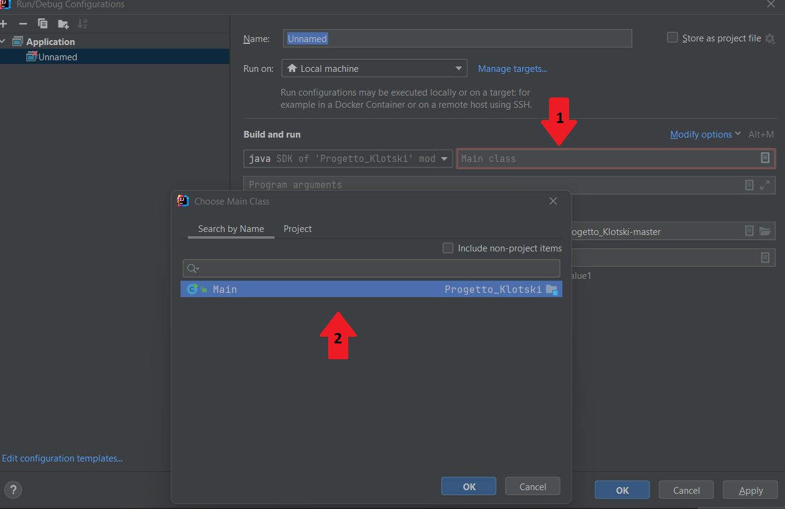

# KLOTSKI PUZZLE

Welcome to the Klotski game project. This is a classic sliding block puzzle game that challenges you to move a large red block into a particular escape position. 
The program is written with Java Swing and uses a database and a solver API hosted on AWS. The project includes the game itself, a test suite, and the documentation. 
The source code is available on GitHub under the MIT License.

## Authors

* [@umberto-bianchin](https://www.https/github.com/umberto-bianchin)
* [@ivanbrillo](https://www.github.com/ivanbrillo)
* [@ricky0219](https://www.github.com/ricky0219)
* [@AlessandroCoron](https://www.github.com/AlessandroCoron)
* [@claudiadecarlo19](https://www.github.com/claudiadecarlo19)

## Badges

[](https://github.com/umberto-bianchin/Progetto_Klotski/blob/master/LICENSE.md)
[](https://www.java.com/en/) 
[](https://nodejs.org/en) 
[](https://aws.amazon.com/)
[](https://https://maven.apache.org/)

[](https://umberto-1.gitbook.io/klotski-game/documentation)
[](https://umberto-bianchin.github.io/Progetto_Klotski/javaDoc/)

## Manual
### How we did it
To start writing the code, we first documented the use cases of the project, modeling all the interactions between the user and the entire system. Next, we identified the main architecture as the MVC (Model-View-Controller) pattern. We created the domain model, sketched the system sequence diagram, and prototyped the user interface (UI). Simultaneously, we modeled the database and later implemented it using AWS. We connected to the database locally through the MySQL connector.

We developed the code incrementally, focusing on one task at a time, which was inspired by the use cases. Each task was written on a local machine, and we used the pair programming technique to boost our productivity. We tested each task before pushing it to the GitHub project. Throughout these cycles, we ensured that all the diagrams and documentation were updated to reflect any modifications made to the initial architecture. Additionally, we implemented new diagrams, such as the internal sequence diagram and class diagram.

One of the final tasks involved implementing the next best move using an external solver in our AWS Lambda. We established communication with our system through POST requests containing JSON parameters. Finally, we wrote and performed tests to assess the coverage of our project and identify any potential issues.
### Requirements
You will need Java to be installed on your computer in order to run the project, and you have to use JDK 19 or newer versions as it has been developed and tested on that version.
You will also need an internet connection.
### Installation

**Follow these steps**:
1) Open our  [@GitHub](https://github.com/umberto-bianchin/Progetto_Klotski)
2) Click on the green button **Code** and then on **Download ZIP**
<figure></figure>

3) Go to the download directory and unzip the file

<details>
<summary> 4) a) Using Maven from cmd </summary>
Navigate to the project folder

```bash
  cd Download\Progetto_Klotski-master
  mvn package -DskipTests
```
You can now find the **JAR file** in the directory named **Target** as **Progetto_Klotski-1.0-jar-with-dependencies.jar**, or you can run it throught cmd with
```bash
cd target
java -jar Progetto_Kltotski-1.0-jar-with-dependencies.jar
```
  
</details>

<details>
<summary> 4) b) Maven not installed </summary>
If you don't have maven installed, but the JAVA_HOME system variable already set-up, you can achive the same results with 
  
```bash
./mvnw package -DskipTests 
```
  
</details>

<details>
<summary> 4) c) Using Intellij Idea</summary>
  
Open **Intellij Idea**, go to the **File** window, then **Open** and select the project folder. After that, click on the configuration window
<figure></figure>

Click on **Add new configuration**, then on **Application**
<figure></figure>

Now select the main class and click on **Ok** on both windows
<figure></figure>

Eventually, click on the run button

</details>

### Game rules

You can read the game rules on the Klotski's [Wikipedia](https://en.wikipedia.org/wiki/Klotski) page

## Documentation

Open the [documentation](https://umberto-1.gitbook.io/klotski-game/documentation)

## Screenshots

<figure></figure>

## Acknowledgements

* [Klotski Solver](https://github.com/jeantimex/klotski/tree/master)

  This excellent NodeJS Klotski solver runs on our AWS Lambda. 

  It is called in Solver class thanks to sendPostRequest() method.
* [FlatLaf](https://www.formdev.com/flatlaf/)

  The FlatLaf library helps us achieve a modern look compared to Java Swing.
  
  Thanks to the setLookAndFeel method we are able to load the look specified by the given class name: FlatDarkLaf (Dark theme)

            UIManager.setLookAndFeel("com.formdev.flatlaf.FlatDarkLaf");

* [GitBook](https://www.gitbook.com/)

  GitBook helped us create clean and organized documentation for this project.
* [Maven](https://maven.apache.org/)
* [JSON simple](https://code.google.com/archive/p/json-simple/)

  JSON Simple helped us in parsing the response from AWS Lambda into separate JSON objects, enabling us to process the data easily.

              moves = (JSONArray) parser.parse(response);
              ...
              JSONObject json = (JSONObject) moves.get(index_moves++);
  
* [MySQL Connector](https://www.mysql.com/)
  We use MySQL Connector to enable interaction and connection to our AWS database, since it provides the required driver. 

        conn = DriverManager.getConnection(dbURL, "admin", "mypassword");
        ...
        ResultSet rs = stmt.executeQuery(query);

  
