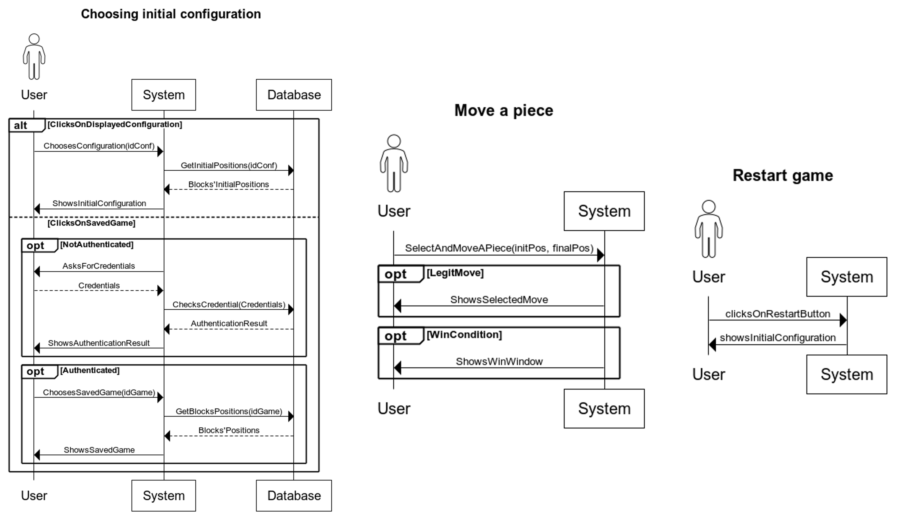
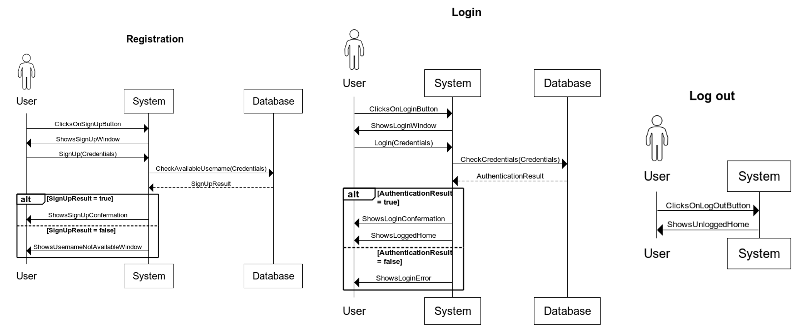
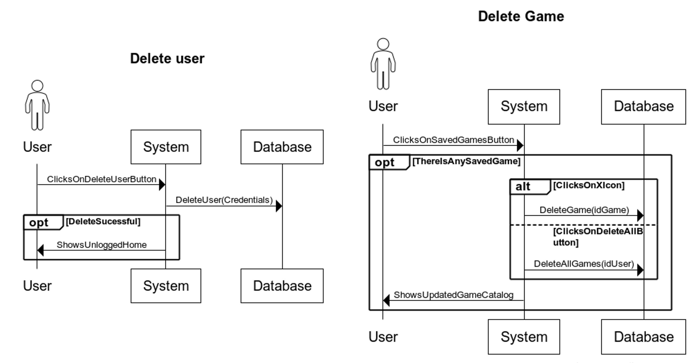

# System Sequence Diagram

<figure><figcaption>
Game
</figcaption></figure>

<figure><figcaption>
Authentication
</figcaption></figure>

<figure><figcaption>
Command
</figcaption></figure>

<figure><figcaption>
Delete
</figcaption></figure>

